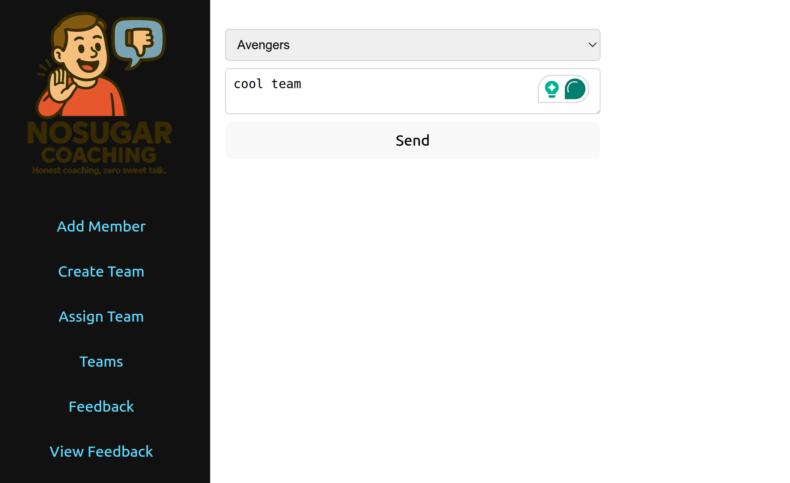

# NoSugar Coaching 

A Simple Team Coaching App without sugar.


## Features

* Create and manage team members
* Assign members to teams
* Provide feedback on team performance
* Provide feedback on people performance

## How to run

Start the entire stack with Docker Compose:

```
./start.sh
```
them, open your browser and go to: [http://localhost:5173/](http://localhost:5173/) <br/>

The MySQL container stores its data in the `mysql_data` directory so it
persists across restarts. The `start.sh` script sets the `MYSQL_DATA_DIR`
environment variable to an absolute path, ensuring Docker always mounts the
same location. This folder is ignored by git.

If you prefer to run the backend manually, start only the database first:

```
docker-compose up -d db
```

Then run the server locally:

```
go run ./backend
```

API endpoints:

- `POST /members`
- `GET /members`
- `GET /members/{id}/feedbacks`
- `POST /teams`
- `GET /teams`
- `POST /assignments`
- `GET /assignments`
- `POST /feedbacks`
- `GET /feedbacks`

### Stack

* Frontend: React, TypeScript, Bun and Vite
* Backend: Go, Gin, Gorm, MySQL
* Database: MySQL running in a Docker container

### Development

This was build using `OpenAI CODEX` in less than `1 hour`.

Notes on the experience:

PROS:

* It was very smooth
* It make very few mistakes (so far)
* It was very fast to open the PRs
* Open PRs on github with MCP is a killer feature
* Codex got me the frontend, backend and database using docker-compose
* Offcourse I knew what I wanted and what I was doing.
* For `1h` of work, I got a lot of code and things done.
* You can see all PRs here: https://github.com/diegopacheco/codex-poc/pulls?q=is%3Apr+is%3Aclosed

CONS:

* I had some issues in parallel tasks, since some tasks was not done, I wish there was better way to describe dependencies.
* on the backend, it generate a single main.go with all the code (sure I could ask it for refactoring but it could have better default)
* Backend is very poor on validations and error handling (sure I could ask it for that)
* When I asked for this: `improve UI: load the logo: logo-app.png on top of the header.tsx` it freaked out completely and generated 3 binary files and fail to create the PR. Also created a bug with a image(corrupted).
* For 99.9% of the time for this POC I used codex on the browser with my GTP Plus subscription, however when I try with my openai api key in my machine and use codex CLI tool(to run local - instead of the cloud) https://github.com/openai/codex where I had the code there already I just asked: `What this project do?` Costed me:
    * 5 openai API Requests
    * 10,670 tokens
    * $0.01
    * Most of the anwsers was all in the README.md anyways <br/>

Botton line: I think it is worth it, but can easily be expensive if you are not careful.

### Results


OpenAI Codex in Action building NoSugar Coaching App <br/>
 >

Add Person <br/>


Add Team <br/>


List Teams <br/>


Asign person to team <br/>


Give Feedback <br/>


List Feedbacks <br/>


### Related POCs

* Anthropic Claude Code https://github.com/diegopacheco/claude-code-poc
* Google Jules https://github.com/diegopacheco/google-jules-poc
* Cursor POC https://github.com/diegopacheco/docker-cleanup
* Gemini-cli POC: https://github.com/diegopacheco/gemini-cli-poc
